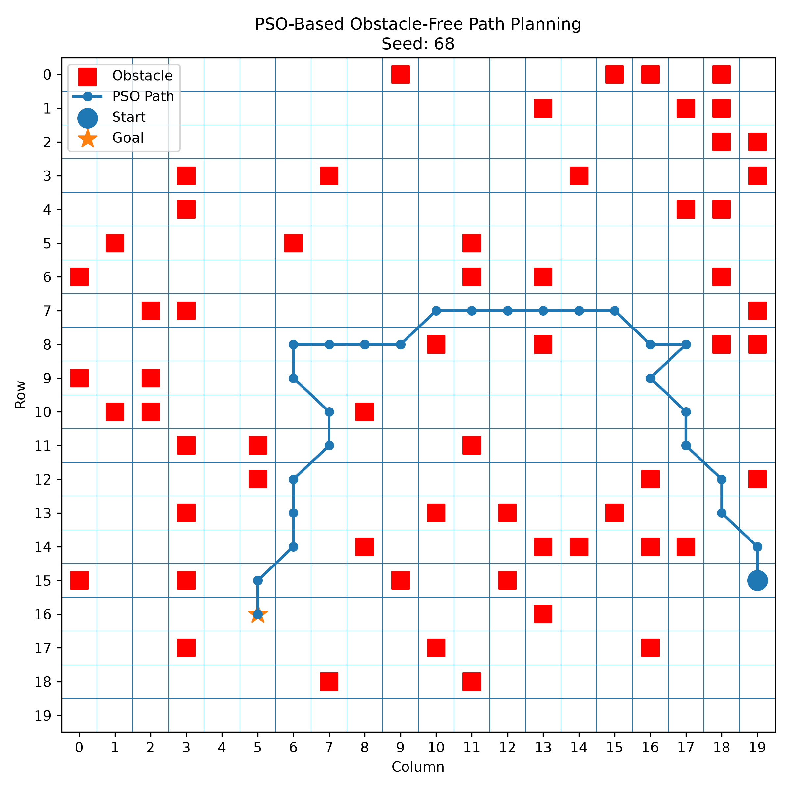
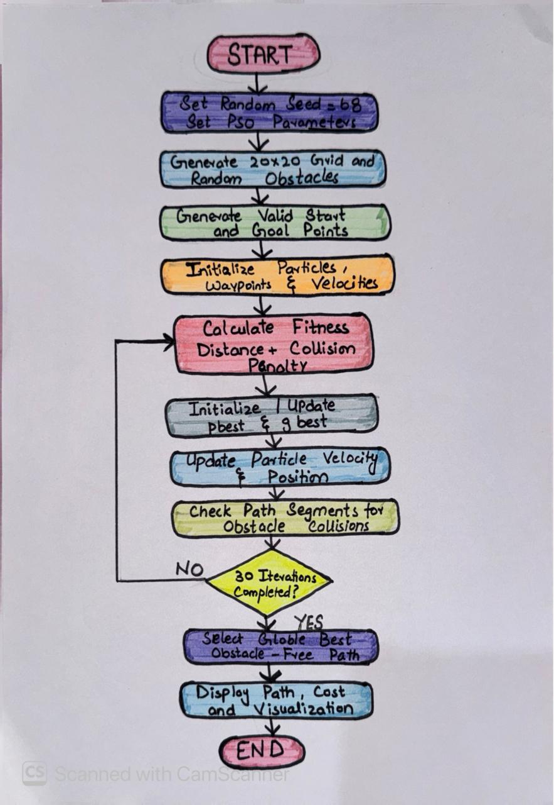

# Swarm-Based Path Planning with Obstacles using PSO

## Assignment 1 - Swarm Intelligence Lab

This project implements **Particle Swarm Optimization (PSO)** for path planning on a 2D grid containing randomly generated obstacles. The objective is to find a short path from a start point to a goal point while avoiding obstacles.

## Student Information

- **Roll Number:** 068
- **Random Seed:** 68
- **Algorithm:** Particle Swarm Optimization (PSO)

## Problem Configuration

The problem environment is generated programmatically using the student's roll number as the random seed.

- Grid Size: 20 x 20
- Random Seed: 68
- Number of Obstacles: 60
- Start Point: (15, 19)
- Goal Point: (16, 5)
- Number of Particles: 10
- Waypoints per Particle: 5
- Number of Iterations: 30
- Inertia Weight (w): 0.6
- Cognitive Coefficient (c1): 1.5
- Social Coefficient (c2): 1.5
- Collision Penalty: 1000

Using the same seed makes the generated environment reproducible.

## Approach

Each PSO particle represents a candidate path from the start point to the goal point using five intermediate waypoints.

The algorithm follows these main steps:

1. Generate the grid and obstacles using seed 68.
2. Generate valid start and goal positions.
3. Initialize PSO particles and their velocities.
4. Represent each particle using five intermediate waypoints.
5. Calculate the path distance for each particle.
6. Detect obstacle collisions along every path segment.
7. Add a large penalty to the fitness value when a path crosses an obstacle.
8. Update each particle's personal best (pbest).
9. Update the swarm's global best (gbest).
10. Update particle velocities and positions.
11. Repeat the optimization for 30 iterations.
12. Return and visualize the best obstacle-free path.

## Fitness Function

The fitness function considers both path distance and obstacle collisions.

```text
Fitness Cost = Total Path Distance + (Number of Collisions x Collision Penalty)
```

A collision penalty of 1000 is used. Therefore, paths crossing obstacles receive a much higher cost than obstacle-free paths.

The objective of PSO is to **minimize the fitness cost**.

## Collision Detection

The path between two waypoints may cross an obstacle even when both waypoints are located on free cells.

Therefore, the program checks all grid cells crossed by every path segment. A Bresenham-style line traversal is used to determine the discrete grid cells between consecutive points.

If any crossed cell is an obstacle, it is counted as a collision.

## Final Result

The final PSO run produced:

- Best Particle: 8
- Best Path Cost: 27.158429109738673
- Number of Obstacle Collisions: 0
- Total Grid Cells in Final Path: 27

Final grid path:

```text
[(15, 19), (14, 19), (13, 18), (12, 18), (11, 17),
(10, 17), (9, 16), (8, 17), (8, 16), (7, 15),
(7, 14), (7, 13), (7, 12), (7, 11), (7, 10),
(8, 9), (8, 8), (8, 7), (8, 6), (9, 6),
(10, 7), (11, 7), (12, 6), (13, 6), (14, 6),
(15, 5), (16, 5)]
```

The final path contains **zero obstacle collisions**.

## Final Path Visualization



## Hand-Drawn Algorithm Flowchart

The following hand-drawn flowchart represents the implementation of the PSO-based path planning algorithm.



## Requirements

- Python 3
- Matplotlib

## How to Run

Clone the repository or download the project files.

Install Matplotlib if it is not already installed:

```bash
pip install matplotlib
```

Run the program:

```bash
python main.py
```

The program will:

- Generate the seeded environment
- Execute the PSO algorithm
- Print the optimization results
- Report obstacle collisions
- Display the final path
- Generate the path visualization

## Project Files

```text
swarm-pathplanning-068/
|
|-- main.py
|-- README.md
|-- pso_path_result.png
|-- flowchart.jpeg
```

## Conclusion

The project demonstrates the use of Particle Swarm Optimization for path planning in an obstacle-based 2D environment. PSO improves candidate paths using personal and global best information, while collision penalties guide the swarm away from obstacles. The final solution successfully reaches the goal with zero obstacle collisions.